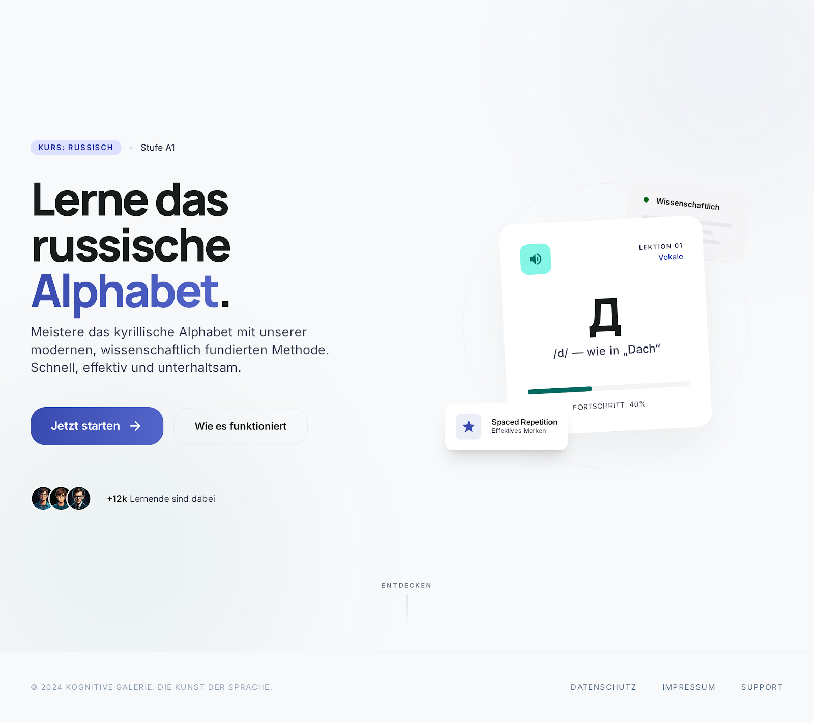

# Cyrillic Alphabet

A production-ready React + TypeScript learning app for mastering the Russian alphabet through a polished quiz flow, persistent progress tracking, and a premium editorial UI.



## Overview

This project turns a static design package into a functional web application while preserving the original visual system:

- React + TypeScript app architecture
- Tailwind styling based on the provided design tokens
- Russian alphabet quiz flow with immediate feedback
- Persistent progress, streaks, XP, and mastery tracking in `localStorage`
- Achievement system with unlock conditions and in-app popups
- Multiple routed screens: landing, quiz, dashboard, achievements, and session complete

The design direction follows the provided "Cognitive Gallery" system:

- No heavy borders
- Surface-layered layouts
- Manrope for headlines, Inter for body copy
- Indigo gradient CTAs
- Minimal shadows and whitespace-first composition

## Features

- Full Russian alphabet dataset with uppercase, lowercase, transliteration, answer label, and per-letter stats
- Four-option multiple choice questions with shuffled answers and no duplicate options
- Keyboard support for answers using `1`, `2`, `3`, and `4`
- Mastery system:
  - A letter is mastered after at least 3 correct answers
  - Accuracy for that letter must be at least 80%
- Quiz selection strategy that prioritizes unmastered letters and occasionally revisits mastered ones
- XP system with:
  - `+10 XP` per correct answer
  - streak bonus
  - session completion bonus
  - perfect round bonus
- Achievement unlocking for:
  - first correct answer
  - 5 streak
  - 10 letters learned
  - 100 XP
  - perfect round
  - 7-day streak
- Dashboard summaries for accuracy, streaks, XP, and category progress

## Tech Stack

- React 18
- TypeScript
- Vite
- Tailwind CSS
- React Router

## Project Structure

```text
src/
  components/      Reusable UI building blocks
  data/            Alphabet and achievement definitions
  hooks/           Quiz, progress, achievements, and persistence hooks
  utils/           Quiz selection, mastery, and storage helpers
  App.tsx          App routing and screen orchestration
```

## Getting Started

### Install dependencies

```bash
npm install
```

### Start the development server

```bash
npm run dev
```

### Build for production

```bash
npm run build
```

### Preview the production build

```bash
npm run preview
```

## Notes

- Progress is stored in the browser using `localStorage`, so user state persists between reloads.
- The repository also includes the original design package in `stitch_cyrillic_alphabet_master/` as the visual source of truth used during implementation.

## Status

The current version includes the full frontend experience and local persistence flow. It is ready to be extended with a backend, authentication, analytics, or real user profiles if needed.
